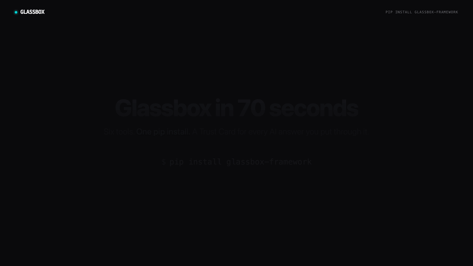

# Glass Box Framework

> **Runtime constitutional verification for AI answers.** Every claim carries a reasoning chain. Every score breaks down. Every verdict is traceable.

[](https://github.com/TheBarmaEffect/glassbox/actions/workflows/ci.yml)
[](https://pypi.org/project/glassbox-framework/)
[](https://www.npmjs.com/package/@glassbox-framework/mcp)
[](https://github.com/TheBarmaEffect/homebrew-glassbox)
[](https://registry.modelcontextprotocol.io/v0/servers?search=glassbox-framework)
[](https://pypi.org/project/glassbox-framework/)
[](LICENSE)
[](https://github.com/TheBarmaEffect/glassbox/stargazers)

> ⭐️ **Star this repo if you want runtime AI verification to become the default.** Every star moves Glassbox up the search ranking on GitHub, the MCP Registry, and Smithery — which means more developers find this before they ship an AI feature without a Trust Card.

<p align="center">
  
</p>

```bash
pip install glassbox-framework         # Python
npm install -g @glassbox-framework/mcp # Node / MCP
brew install thebarmaeffect/glassbox/glassbox-mcp   # macOS
```

## What it is

The Glass Box Framework hands an `(question, answer)` pair to a runtime verification pipeline and returns a structured **Trust Card** containing:

- **Claims** — every atomic assertion in the answer, paired with a *reasoning chain* explaining why it's asserted, what would support it, and what would falsify it.
- **Epistemic Confidence Score (ECS)** — a transparent, weighted aggregate over five dimensions with a *published formula* and an always-visible per-dimension breakdown.
- **Glassbox Court** — seven adversarial probes (fabrication, source manipulation, bias injection, context attack, overconfidence, underspecification, constitutional violation).
- **Constitution** — your natural-language deployer intents compiled into structured runtime rules and evaluated against the answer.
- **Verdict** — `trust` / `caution` / `reject`, with the exact reasoning that derived it.
- **Audit reference** — a deterministic SHA-256 log_id; identical inputs reproduce the same identifier across runs and languages.

It is intentionally **not a wrapper around a single LLM call** — the reasoning chain on every claim, the formula on the ECS, and the determinism of the audit hash together form the "Glass Box" principle: no opaque scores.

## Quick start (Python)

```python
from glassbox_framework import Glassbox

with Glassbox() as gb:
    card = gb.verify_answer(
        question="Can intermittent fasting cure type 2 diabetes?",
        answer="Yes ...",
        intents=[
            "Never make specific medical claims without citing peer-reviewed sources.",
            "Always recommend consultation with a licensed healthcare professional.",
        ],
    )

print(card["verdict"])              # "reject"
print(card["ecs"]["total"])         # 0.6032
print(card["audit"]["log_id"])      # glassbox-85cc09903bd4...  (deterministic)
```

## The six tools

| Tool | Purpose |
| :--- | :--- |
| `glassbox_verify_answer` | Full pipeline → Trust Card |
| `glassbox_extract_claims` | Atomic claims with reasoning chains |
| `glassbox_score_ecs` | ECS with full breakdown + formula |
| `glassbox_red_team` | Glassbox Court — 7 adversarial probes |
| `glassbox_generate_trust_card` | Assemble a Trust Card from prebuilt parts (no LLM call) |
| `glassbox_export_audit_report` | Full pipeline + deterministic SHA-256 audit log |

Full schemas, examples, and configuration: [`mcp/README.md`](mcp/README.md). Python pip-specific docs: [`mcp/python/README.md`](mcp/python/README.md).

## Architecture (two-layer)

```
┌──────────────────────────────────────────────────────────┐
│ glassbox-framework (PyPI)         Python client          │
│   thin JSON-RPC stdio wrapper                            │
│   spawns ↓                                               │
├──────────────────────────────────────────────────────────┤
│ @glassbox-framework/mcp (npm)     Node MCP server        │
│   6 tools, Zod-validated I/O                             │
│   ↳ verify_answer  ↳ extract_claims  ↳ score_ecs         │
│   ↳ red_team       ↳ generate_trust_card                 │
│   ↳ export_audit_report                                  │
└──────────────────────────────────────────────────────────┘
```

The Python client makes zero LLM calls itself; it forwards arguments to the MCP server over stdio and renders the returned JSON. Set `ANTHROPIC_API_KEY` once and both layers use it.

## Use with Claude Desktop

```json
{
  "mcpServers": {
    "glass-box": {
      "command": "npx",
      "args": ["-y", "@glassbox-framework/mcp"],
      "env": { "ANTHROPIC_API_KEY": "sk-ant-..." }
    }
  }
}
```

`~/Library/Application Support/Claude/claude_desktop_config.json` on macOS.

## Determinism

Audit `log_id`s are SHA-256 over canonicalised JSON of `(inputs_hash, claims, ECS dimensions, red-team probe verdicts, constitution evaluations)`. Timestamps are recorded but never enter the hash, so identical inputs *and* identical engine outputs always produce the same `log_id` — across runs, machines, and even languages (the Python client → Node server → JSON canonicalisation produces byte-identical hashes).

Verifiable example, no API key needed:

```bash
pip install glassbox-framework
python -c "
import json
from glassbox_framework import Glassbox
with open('mcp/demo/raw-inputs.json') as f: i = json.load(f)
with Glassbox() as gb:
    c = gb.generate_trust_card(
        question=i['question'], answer=i['answer'],
        claims=i['claims'], red_team=i['red_team'], ecs=i['ecs'],
        constitution=i['constitution'])
print(c['audit']['log_id'])   # glassbox-85cc09903bd4b3f8022a4087
"
```

## Project layout

```
mcp/                       — the MCP server + Python client (this release)
  ├── src/                 — TypeScript MCP server (6 tools)
  ├── python/              — Python pip package (glassbox-framework)
  ├── homebrew/            — Homebrew formula
  ├── assets/              — Launch video + reveal + title cards
  ├── demo/                — Live terminal demo with prebuilt Trust Card
  ├── Dockerfile           — Container image
  ├── server.json          — MCP Registry manifest
  ├── smithery.yaml        — Smithery.ai manifest
  ├── LAUNCH.md            — Launch kit
  └── DISTRIBUTION.md      — Every channel's status + commands
LICENSE                    — Apache 2.0
ROADMAP.md                 — Phase 5 (governor) plans for the broader framework
CONTRIBUTING.md
CHANGELOG.md
```

## Contributing

Glassbox is open source under Apache 2.0 and **actively wants forks and PRs.** A few specific places we'd love help:

- **More red-team probes** — `mcp/src/engines/redteam.ts` has `// v2:` placeholders for `alignment_faking`, `reasoning_trace_deception`, `eval_awareness_gaming`, `agentic_misalignment`, and `sustained_jailbreak`. Each is a tractable PR — same shape as the existing 7 probes, just a different angle. See [`.github/ISSUE_TEMPLATE/good_first_issue.md`](.github/ISSUE_TEMPLATE/good_first_issue.md).
- **More language clients** — currently Python (`glassbox-framework`) and Node (`@glassbox-framework/mcp`). Go, Rust, Ruby, Swift, Kotlin would all be welcome as thin JSON-RPC clients that spawn the existing MCP server.
- **More integrations** — Cursor / Cline / Continue / Roo Cline / Zed / Neovim — wherever MCP is read, Glassbox should be one paste away.
- **Real-world Trust Card examples** — submit (Q, A) pairs from your own AI workflows so the test suite covers more terrain.

Process:
1. Pick a `good first issue` or open one with your idea
2. Fork, branch, work — the [PR template](.github/PULL_REQUEST_TEMPLATE.md) walks you through verification
3. CI must pass ([`.github/workflows/ci.yml`](.github/workflows/ci.yml)) — TS strict mode, Python wheel build, **cross-language determinism on the canonical audit hash**
4. Open the PR; we aim for review within 48 hours

Code of conduct: [Contributor Covenant 2.1](CODE_OF_CONDUCT.md). Be kind, stay on substance, no harassment, contact `golla.sat@northeastern.edu` for anything off-public-channel.

## Star ⭐ this repo

The fastest way to help right now is to star the repo. Every star:
- Surfaces Glassbox higher in GitHub's MCP topic listings
- Pushes the project up on the MCP Registry and Smithery rankings
- Tells the next developer evaluating AI-safety tooling that this is the one with eyes on it

[**⭐ Star Glassbox**](https://github.com/TheBarmaEffect/glassbox/stargazers)

## Author

**Karthik Barma** · MS Artificial Intelligence · Northeastern University.

**Powered by Aura.**

Issues + PRs: <https://github.com/TheBarmaEffect/glassbox/issues>
